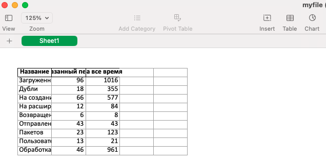

**Тестовое задание по анализу файла**
* Перед началом работы необходимо задать переменные окружения согласно
  примеру в файле `.env.example`

* Для запуска приложения в докере необходимо запустить команду 
    ```
    docker compose up --build
    ```
  Порой бывают проблемы с файлом `entrypoint.sh`, чтобы исправить проблему можно
  использовать команду
    ```
    chmod +x entrypoint.sh
    ```
* Для установки пакетов локально достаточно использовать команду `poetry install`
* Пример работы
  
  Документация к API доступна по url `http://0.0.0.0:8000/docs/`
  Загрузить файл можно в свагере по endpoint-y `upload-file` и 
  необходимо указать дату для сотировки значений:
  
  Далее можно скачать файл:
  
  Просмотр файла:
  
  Также есть возможность просмотреть все результаты по url `api/reports/results`
  Результат работы тестов
  